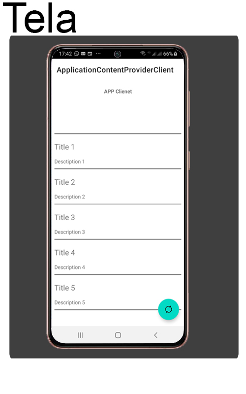

# ContentPtoviderClient App with Kotlin 

Hello welcome

This was another one of Everis' Bootcamp modules at DIO.

This app was developed as an exercise in sharing Content Provide.

This app accesses the data of content Provided from another app and shows it on the screen.

It can even be updated in real-time

Feel free to look, I am open to tips and suggestions.

# Screens

